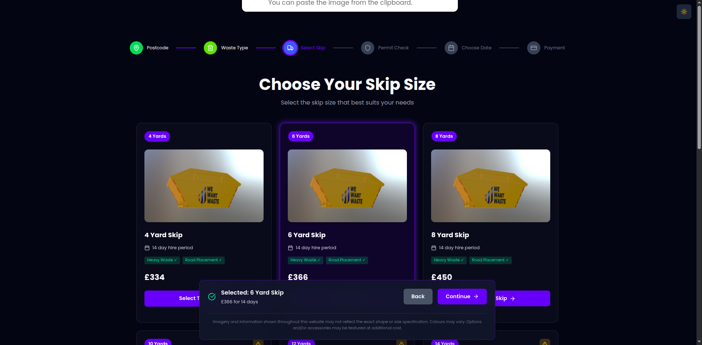
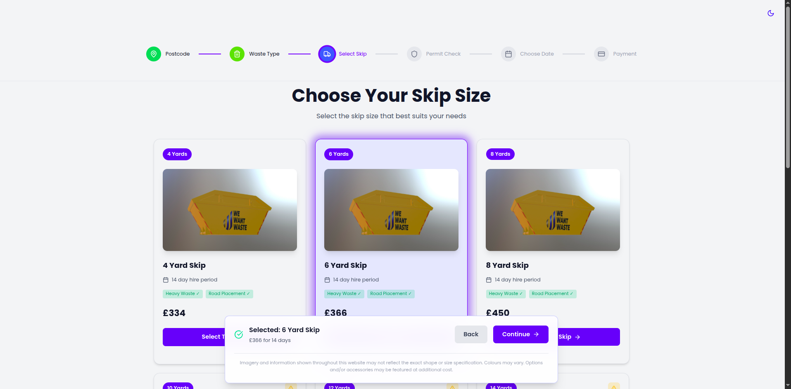

# ♻️ WeWantWaste Skip Size Page Redesign

A redesigned **"Choose Your Skip Size"** page built with React, offering modern UI/UX, mobile responsiveness, smooth animations, and dark/light mode support.

---

## 🚀 Tech Stack

- ⚛️ React 19
- ⚡ Vite
- 🎨 Tailwind CSS 4
- 🔌 Axios (API integration)
- 🎞️ Framer Motion (animations)
- 🧩 Lucide React (icons)

---

## ✨ Features

- ⚡ Modern, clean, and responsive layout
- 🌗 Dark / Light mode toggle (via `ThemeContext`)
- 📱 Optimized for mobile and desktop
- 🔗 Dynamic skip size data from live API
- 🧼 Clean and maintainable React architecture

---

## 🧠 Approach

I redesigned the skip selection page using **React 19**, **Tailwind CSS 4**, and modern frontend best practices. Focused on maintainability, accessibility, and responsiveness.

### ✅ Key Decisions:

- 🌙 **Dark/Light Mode**  
  Built with custom `ThemeContext` and `localStorage` support. Used Tailwind’s `dark:` class strategy for seamless theming.

- 📦 **Component Architecture**  
  Modular components (`SkipCard`, `ThemeToggle`, etc.) with clear responsibilities.

- 🔌 **API Integration with Axios**  
  Fetched live skip data from the provided API dynamically and rendered it with proper UX feedback.

- 🎞️ **Animations via Framer Motion**  
  Smooth page transitions and card animations for better user interaction.

- 📱 **Mobile-First Design**  
  Responsive layout using Tailwind’s utility classes and breakpoint strategies.

- ✨ **Clean UI Enhancements**  
  Carefully chosen icons, hover/focus states, and spacing to ensure a polished, accessible UI.

- ⚡ **Vite Dev Environment**  
  Fast hot-reload, lightweight bundling, and optimized dev experience.

---

## 📸 Screenshots

### 🌙 Dark Mode  


### ☀️ Light Mode  


---

## 🔗 Demo & Repository

- 🔴 **Live Demo**: [Click here](https://remwaste-lilac.vercel.app/)
- 📁 **GitHub Repository**: [github.com/OTH-DOT/remwaste](https://github.com/OTH-DOT/remwaste)

---

## 🛠️ Installation

```bash
git clone https://github.com/OTH-DOT/remwaste.git
cd remwaste
npm install
npm run dev

